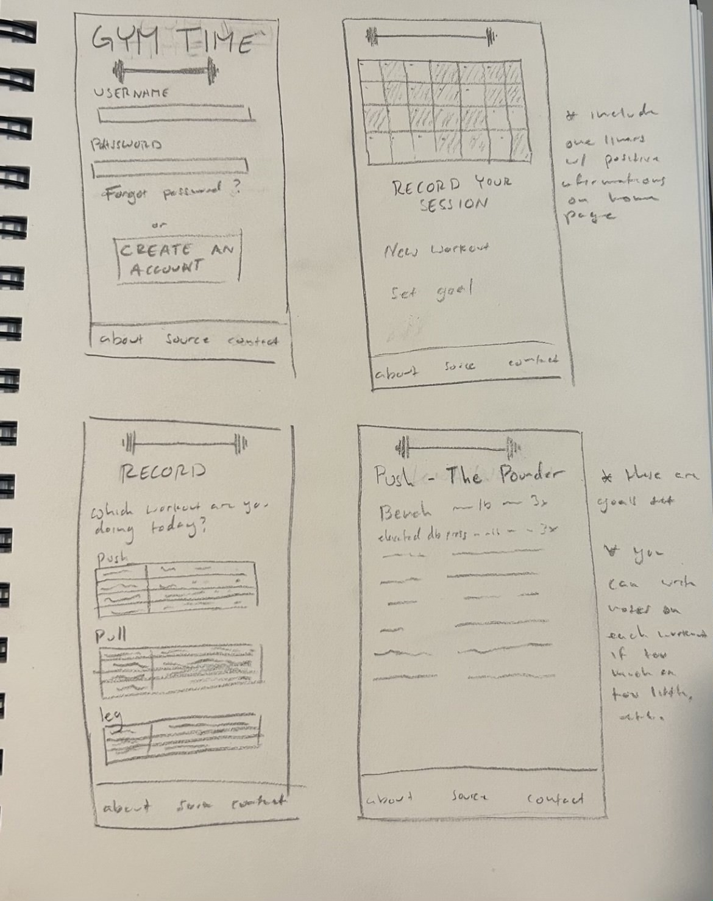

# devEnv/Startup/Project/ProjSpecs/ProjSpecs.md

# URL: https://startup.gymtime-mb.com

# Elevator Pitch
Are you still using a notepad and paper to record improvement of your gains at the gym? If so, I am sure you have wished for a better digital version. Now with Gym Time you can do just that. Set goals, record changes, make notes, see workout history, and enjoy control over your workout schedule. It will boost moral for those looking for better organization and improve the effectiveness of every workout. It is free to join, all you need is a gym membership and good discipline. The next thing you know, king, is your shirts will fit better, youll have more confidence, and take control of all the unorganized aspects of your lif

# Sketch ideas

# Key Features
## Login Page
The login page will be displayed first with a sign up or log in option. You will also have the option to log in as a guest and view other users records.

## Record Page
This record page is where the you will record whether or not you went to the gym that day and/or any notes you want to look back on in the future. 

Above the record section, there will be a calendar where you can see when you previously went to the gym and any notes you made on that day. You can select any day and go back to read any recorded notes on a unique notes page. 

## Notes Page
the notes page will be only accesable from the Record page. You can change a note for your current date. You can view notes for previous dates.

## Contact Page
The Contact Page will allow the user to contact the business for any issues, concerns, comments, or questions they may have. It will also contain an "about" section explaining the apps history and purpose. 

# Represent All Technologies
* Authentication: User imput will will either create an account or log into an existing acount.
* Database data: The dates of when the user went to the gym(Calendar) and any notes they made on that day are stored here. Other users calendars can also be accessed.
* WebSocket data: This occurs when the user records a session and/or makes a note after logging in. 

## HTML
For this deliverable I added the application structure.

* HTML pages - Six HTML page that represent the ability to login, create an account, view your workout calendar, record your workout, view other peoples records, and a contact.
* Links - Every page is linked to to each other. On the login page there is are buttons for creating an account and loging in. on the calendar page there is a button linking you to the record your workout page.
* Text - There is text embedded throughout the website.
* Images - An image is included on the contact us page.
* Login - email and password inputs are used to login.
* Database - the database will be accessed from the login page, calendar page (which will record every day you have recorded a workout), and on the social page(getting data from other users who have recorded their work)
* WebSocket - the social page statistics will represent the actual count of other users.

## CSS Deliverable

For this deliverable I properly styled the application into its final appearance.

* Header and main content body
* Navigation elements - I dropped the underlines and changed the color for anchor elements.
* Responsive to window resizing - My app looks great on all window sizes and devices
* Application elements - Used good contrast and whitespace
* Application text content - Consistent fonts
* Application images - Image is found on contact us page.

## Java Deliverable 

Forthis delivarable I properly demonstrate an understanding of JavaScript and its implementation of creating logic and a mocked database. 

* Supports future login by storing user data in objects stored in local storage API 
* Supports future WebSocket application - the number of times you log in and record workouts appear on the the social page, along with the login information from other users.
* Internal logic created - if you login with an email your email will be displayed as the user and on the social page. If you create an account and login, your name will then be displayed on the calendar and social page. Also, the number of times you login and record a workout is displayed on the social page. 

* note that saving comments, accessing previous days information and workout records are not yet accessable. This deliverable is to demonstrate an understanding of using Java to create logic and store information in a mocked database, not a fully functional website.

... Not yet

## Startup Services

* Create an HTTP service using Node.js and Express
* Frontend is served up using Express static middleware
* my frontend calls third party service endpoints in the contact page
* my backend provides service endpoints
* frontend calls service endpoints

## DataBase - Mongo DB

* MongoDB Atlas database created 
* Provides several backend endpoints for manipulating application data
* Stores application and user data in MongoDB

## Secure Login 

* Supports new user registration
* Supports existing user authentication
* Encripts sensitive information
* stores and retrieves credentials via MongoDB
* restricts application functinality based upon authentication

